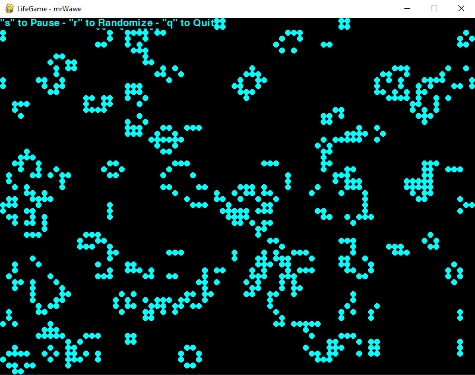

Conway's Game of Life
=====================

Pygame implementation of Conway's Game of Life.
Followed `DevDungeon's YouTube tutorial
<https://www.youtube.com/watch?v=VNAU7HH4QRw&ab_channel=DevDungeon>`_

Screenshot
__________

Installation
------------

Install with pip::

    pip install mygameoflife

Install from source::

    python setup.py install

Running
-------

Run via launch script installed with pip package::

    mygameoflife

Run as a Python module::

    python -m mygameoflife

Using inside of code
--------------------

To import the class into your own code::

    from mygameoflife.LifeGame import LifeGame
    LifeGame().run()

Controls
--------

There are a couple keybinds available:

- s - Start/stop (toggle pause)
- r - Randomize the grid
- q - Quit

Source code
___________
https://github.com/

Contact
-------

mrWawe <email@email.com>

Changelog
---------
